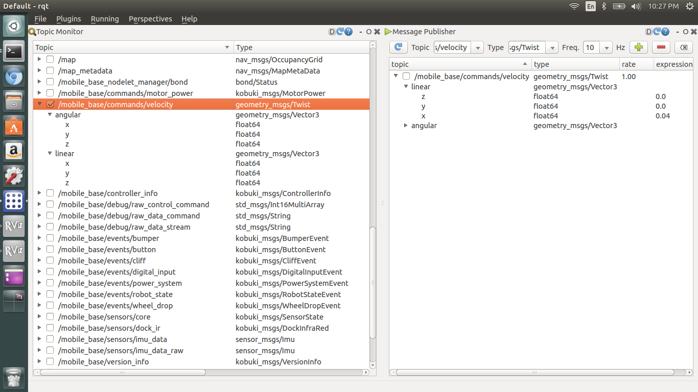

# sulcata-web

[To read English version.](README.md)

## Description
본 저장소는 로봇 통합 프로젝트인 [설카타](http://github.com/bus710/sulcata)의 한 부분 입니다. 본 프로젝트는 설카타 위에 추가로 진행되었으므로, 실제 구동을 확인하기 위해서는 설카타를 먼저 진행하셔야 합니다. 본 프로젝트의 주요 목표는 로봇 개발자들을 위한 쉬운 웹 인터페이스를 제공하는데 있습니다. 그것을 위해 키보드를 통한 로봇 제어와 지도 표시, 카메라 영상 전송 등이 웹 브라우저를 통해 보여질 것 입니다. 기존에 ROS 기반 로봇을 제어하며 영상과 지도를 받기 위해서는 또 다른 ROS 호스트가 필요하던 것에 비해, 웹 브라우저로 제어와 계측을 하는 것은 비교적 쉬운 방식이 될 것이라 생각 합니다. 

사용자들은 다음과 같은 기능을 사용할 수 있습니다.
- 설카타의 베이스인 거북이를 웹을 통해 제어 합니다.
- 기존에 rviz로 관찰할 수 있었던 2d 지도를 브라우저를 통해 볼 수 있습니다.
- 또한 키넥트가 촬영하는 영상도 브라우저를 통해 제공 됩니다. 

실제 구동 영상은 유튜브를 통해 확인 할 수 있습니다. [https://youtu.be/e_FdrEWOHgA](https://youtu.be/e_FdrEWOHgA)  

## Maintainer
- [SJ Kim](http://bus710.net) <<bus710@gmail.com>>

## Table of contents
- [Description](#description)
- [Requirement](#requirement)
- [Keyop Example](#keyop-example)
- [Map Example](#map-example)
- [Cam Example](#cam-example)
- [Commentary](#commentary)
- [Todolist](#todolist)
- [Reference](#reference)

## Requirement
모든 하드웨어와 소프트웨어는 기존 설카타를 기반으로 진행 됩니다.

## Keyop Example
첫번째 예제인 키옵 예제 입니다. 이것은 [keyboard-teleop-js](http://wiki.ros.org/keyboardteleopjs/Tutorials/CreatingABasicTeleopWidgetWithSpeedControl)를 기반으로 구현 되었습니다. 본 예제를 실행하면 웹 브라우저 상에서 속도 제어용 bar를 볼 수 있으며, 키보드 입력 - 상하좌우를 통해 거북이의 움직임을 제어할 수 있게 됩니다. 

### Installation
먼저 필요한 웹서버인 node 스택을 설치하기 위해 다음과 같이 입력 합니다. 물론 모든 필요한 파일은 본 저장소에 포함 되어 있습니다. 
```
sudo apt-get install ros-indigo-rosbridge-*
sudo apt-get install ros-indigo-robot-pose-publisher
sudo apt-get install ros-indigo-mjpeg-server
sudo apt-get install npm node
sudo ln -s /usr/bin/nodejs /usr/bin/node

cd ~/Download
git clone http://github.com/bus710/sulcata-web
cd sulcata-web/keyop-example
npm install
```

### Launch
설치가 완료 되면 기존 설카타 스택에 더해 하나의 ros 앱을 추가로 실행해야 합니다. 이 후 새 터미널에서 웹서버를 실행해 주어야 합니다. 
```
cd ~/Download/sulcata-web/scripts
./06_rosbridge

# in a new terminal
cd sulcata-web/keyop-example
npm start
```

### Access
위 과정 후에는 웹 브라우저를 통해 당신의 로봇을 제어할 수 있을 것 입니다. 그러나 현재 로봇이 사용하는 ip 주소를 확인하시기 바랍니다. 제 경우에는 '192.168.0.5'를 사용하였기에 웹 브라우저에서 192.168.0.5:3000으로 접속하였습니다. 
  


위 화면이 무사히 뜬 경우에는 웹 브라우저에서 상하좌우 키를 눌러 로봇을 제어할 수 있을 것입니다. 

## Map Example
본 예제는 이전 예제인 keyop 예제에 추가로 개발 되었습니다. 웹 브라우저에 2차원 지도를 띄우며 동시에 키 입력을 통해 로봇을 제어할 수 있습니다. 

### Installation
첫 예제와 동일한 과정으로 설치가 가능 합니다. 단 keyop-example이 아닌 map-example을 이용하셔야 합니다.
```
sudo apt-get install ros-indigo-rosbridge-*
sudo apt-get install ros-indigo-robot-pose-publisher
sudo apt-get install ros-indigo-mjpeg-server
sudo apt-get install npm node
sudo ln -s /usr/bin/nodejs /usr/bin/node


cd ~/Download
git clone http://github.com/bus710/sulcata-web
cd sulcata-web/map-example
npm install
```

### Launch
설카타 스택 이후에 추가로 두가지 ros 앱을 실행 하고, 웹 서버를 아래와 같이 실행해 줍니다. 
```
cd ~/Download/sulcata-web/scripts
./06_rosbridge

# in a new terminal
cd ~/Download/sulcata-web/scripts
./07_robot_pose_publisher

# in a new terminal
cd sulcata-web/map-example
npm start
```

### Access  
위 과정 후에는 웹 브라우저를 통해 당신의 로봇을 제어할 수 있을 것 입니다. 그러나 현재 로봇이 사용하는 ip 주소를 확인하시기 바랍니다. 제 경우에는 '192.168.0.5'를 사용하였기에 웹 브라우저에서 192.168.0.5:3000으로 접속하였습니다. 

## Cam Example
본 예제는 위의 두 예제에 더해 개발 되었습니다. 하나의 웹 페이지에서 로봇 제어와 지도, 영상 확인을 동시에 확인 할 수 있습니다. (주의할 점은 본 예제에 쓰인 keyboard-teleop-js가 공식 저장소의 것과 약간 다르게 편집 된 점 입니다. 개인 취향으로 상하좌우 키 대신에 hjkl - vim 네비게이션 키 입력으로 변경하였습니다. 

### Installation
역시 본 저장소에서 모든 것을 구할 수 있습니다만, mjpeg-server를 추가로 설치해 주어야 합니다. 
```
sudo apt-get install ros-indigo-rosbridge-*
sudo apt-get install ros-indigo-robot-pose-publisher
sudo apt-get install ros-indigo-mjpeg-server
sudo apt-get install npm node
sudo ln -s /usr/bin/nodejs /usr/bin/node

cd ~/Download
git clone http://github.com/bus710/sulcata-web
cd sulcata-web/cam-example
npm install
```

### Launch
실행 또한 이전과 유사 합니다. 단 이번엔 세개의 스크립트를 실행한 후에 웹 서버를 실행해 주어야 합니다. 
```
cd ~/Download/sulcata-web/scripts
./06_rosbridge

# in a new terminal
cd ~/Download/sulcata-web/scripts
./07_robot_pose_publisher

# in a new terminal
cd ~/Download/sulcata-web/scripts
./08_mjpeg_server

# in a new terminal
cd sulcata-web/cam-example
npm start
```

### Access
위 과정 후에는 웹 브라우저를 통해 당신의 로봇을 제어할 수 있을 것 입니다. 그러나 현재 로봇이 사용하는 ip 주소를 확인하시기 바랍니다. 제 경우에는 '192.168.0.5'를 사용하였기에 웹 브라우저에서 192.168.0.5:3000으로 접속하였습니다. 

  
  
위와 같은 화면을 보게 되었다면 성공! 이제 hjkl 키를 통해 거북이를 조종하고 영상을 통해 현재 거북이의 시점을 확인 할 수 있습니다. 테스트 장소가 넓어서 로봇이 시야에서 멀어지면 유용하겠죠?^^

## Commentary
### ROS, node.js, roslibjs의 통합 과정
본 해설에서는 기존의 공식 html 파일을 실제로 구동 되는 환경과 어떻게 통합하는지에 대해 설명 합니다. (본 저장소에서 파일을 받아서 단순히 실행하는 경우에는 한번 훑어보고 지나가셔도 무방 합니다.) robotwebtool에서 제공 되는 파일은 클라이언트용의 html과 javascript가 통합된 형태이기 때문에 아래와 같은 4가지 주요 과제가 진행 되어야 했습니다. 
  
1. node.js로 웹서버의 틀을 구성할 것.
2. 공식 html 파일을 node.js에 맞게 분할 할 것. 
3. keyop, 2D map, video 예제의 javascript 파일을 client.js 파일에 통합할 것.
4. node.js 웹서버를 실행 할 것.

첫번째 과제는 다행히도 node.js/express 프레임웍이 제공하는 도구인 express-generator를 통해 쉽게 해결이 가능 합니다. 저 명령어를 실행하면 현재 디렉토리 아래로 웹서버 구동에 필요한 모든 기초적인 파일이 자동으로 생성 됩니다. (해당 구조는 하단에서 확인 가능 합니다.) 그 파일들에는 우리가 사용할 jade 파일과 javascript 파일이 포함 됩니다. 다만 본 프로젝트에서는 기본 웹서버 뿐 아니라 여러 node.js 라이브러리가 필요하므로, 저 app.js 가 저장된 디렉토리로 이동하여 본 저장소가 제공하는 package.json을 복사한 후, npm install을 실행해 주어야 합니다. 이 명령어는 npm 저장소에서 필요 라이브러리를 자동으로 다운로드 및 설치해 줍니다.   
  
둘째 과제는 robotwebtool이 제공하는 공식 파일을 방금 생성한 웹 프레임웍에 맞게 녹여내는 작업 입니다. html 파트는 layout.jade와 index.jade로 나눠서 저장 되어야 하고, javascript 파일은 client.js 파일에 저장 되어야 합니다.    
  
셋째 과제는 javascript에 대한 약간의 지식이 필요합니다. 여러 공식 파일에서 제공하는 javascript 파일을 하나의 javascript에 통합시켜야 하기 때문 입니다. 다만 그것은 알고리즘과는 거리가 있는 단순 복사-붙여넣기 수준이므로, client.js 파일의 패턴을 자세히 관찰한다면 크게 어려운 부분은 아닐 것 입니다.   
  
넷째 과제는 웹서버 실행하기 입니다. 위에서 npm install을 했던 것과 유사하게 동일한 위치에서 npm start를 실행해 줍니다. 다만 본 저장소는 세가지 다른 예제를 제공하므로, 필요에 따라 디렉토리를 잘 선택해야 할 것 입니다.  

아래는 express-generator를 통해 생성한 디렉터리와 저장된 파일들의 위치를 보여줍니다.
```
keyop-example
├── app.js
├── bin
│   └── www
├── package.json
├── public
│   ├── images
│   ├── javascripts
│   │   └── client.js
│   └── stylesheets
│       └── style.css
├── routes
│   ├── index.js
│   └── users.js
└── views
    ├── error.jade
    ├── index.jade
    └── layout.jade
```

cdn을 사용하지 않고 라이브러리를 서버에서 직접 클라이언트에게 제공하는 경우엔 public/build 디렉토리에 저장해야 할 것 입니다. 
```
keyop-example
├── app.js
├── bin
│   └── www
├── package.json
├── public
│   ├── build
│   │   ├── keyboardteleop.js
│   │   └── keyboardteleop.min.js
│   ├── images
│   ├── javascripts
│   │   └── client.js
│   └── stylesheets
│       └── style.css
├── routes
│   ├── index.js
│   └── users.js
└── views
    ├── error.jade
    ├── index.jade
    └── layout.jade
```

### 필요한 토픽을 찾는 방법에 대하여.
만약 여러분이 ROS를 쓰되, 설카타가 아닌 다른 로봇에 본 저장소를 적용하고자 하는 경우에는 roscore를 통해 교환 되는 토픽이 약간은 다른 이름을 가지고 있을 수 있습니다. 그런 경우에는 특히 client.js 내에서 명시하는 토픽 이름이 현재 구동 되는 로봇이 사용하는 토픽의 이름과 동일해야 할 것 입니다. 

아래의 스크린샷에서 볼 수 있듯이, 토픽을 추적하고 제어하기 위해서는 rqt라는 gui 도구를 사용해야 합니다. 저 스크린샷의 경우에는 /mobile_base/commands/velocity 를 사용하였습니다. 만약 client.js 파일을 열어 본다면 동일한 토픽에 접근하는 메소드를 확인 할 수 있을 것이며, 바로 그 부분이 당신의 로봇을 위해 수정 되어야 할 부분 입니다. (아마 대부분의 터틀봇/거북이류는 동일한 이름을 사용할 것이라 짐작 됩니다.)




## Todolist
이제 당신은 웹 인터페이스를 통해 시스템을 제어하고 관측할 수 있을 것 입니다. 이 다음엔 무엇에 도전해야 할까요? 저의 다음 목표는 다음과 같습니다. 혹시 관심 있으신 분들께선 풀리퀘스트 또는 이슈를 통해 연락 부탁 드립니다. 

- 웹 기반 액션 관리자
- 웹 기반 3차원 재구성 
- 웹 기반 네비게이션 

## Reference
[1] http://wiki.ros.org/Books/ROS_Robot_Programing   
[2] https://github.com/oroca/rosbook_kobuki  
[3] http://wiki.ros.org/kobuki   
[4] https://github.com/GT-RAIL/keyboardteleopjs  
[5] http://wiki.ros.org/keyboardteleopjs/Tutorials/CreatingABasicTeleopWidgetWithSpeedControl  
[6] http://wiki.ros.org/nav2djs/  
[7] http://wiki.ros.org/nav2djs/Tutorials/CreatingABasicNav2DWidget  


