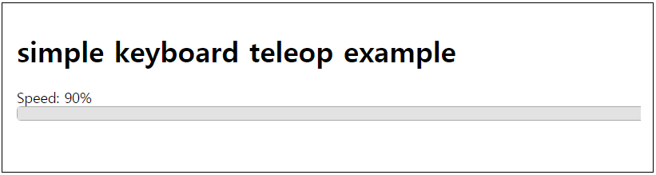
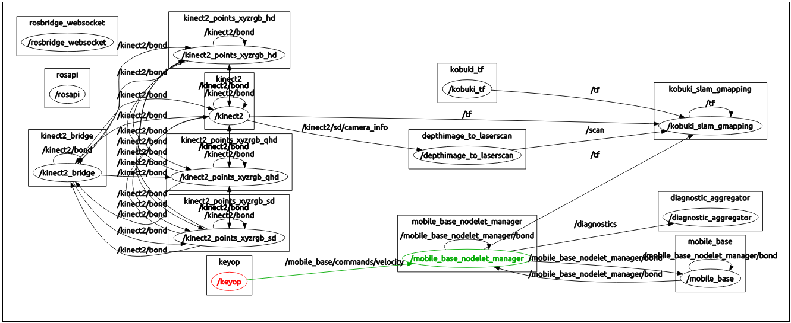

# sulcata-web

[To read English version.](README.md)

## Description
본 저장소는 로봇 통합 프로젝트인 [설카타](http://github.com/bus710/sulcata)의 한 부분 입니다. 본 프로젝트는 설카타 위에 추가로 진행되었으므로, 실제 구동을 확인하기 위해서는 설카타를 먼저 진행하셔야 합니다. 본 프로젝트의 주요 목표는 로봇 개발자들을 위한 쉬운 웹 인터페이스를 제공하는데 있습니다. 그것을 위해 키보드를 통한 로봇 제어와 지도 표시, 카메라 영상 전송 등이 웹 브라우저를 통해 보여질 것 입니다. 기존에 ROS 기반 로봇을 제어하며 영상과 지도를 받기 위해서는 또 다른 ROS 호스트가 필요하던 것에 비해, 웹 브라우저로 제어와 계측을 하는 것은 비교적 쉬운 방식이 될 것이라 생각 합니다. 

사용자들은 다음과 같은 기능을 사용할 수 있습니다.
- 설카타의 베이스인 거북이를 웹을 통해 제어 합니다.
- 기존에 rviz로 관찰할 수 있었던 2d 지도를 브라우저를 통해 볼 수 있습니다.
- 또한 키넥트가 촬영하는 영상도 브라우저를 통해 제공 됩니다. 

Users can:  
- control Kobuki via web interface.
- monitor a 2D map on your web browser.
- watch a video stream on your web browser.

See also [https://youtu.be/e_FdrEWOHgA](https://youtu.be/e_FdrEWOHgA)  

## Maintainer
- [SJ Kim](http://bus710.net) <<bus710@gmail.com>>

## Table of contents
- [Description](#description)
- [Requirement](#requirement)
- [Keyop Example](#keyop-example)
- [Map Example](#map-example)
- [Cam Example](#cam-example)
- [Commentary](#commentary)
- [Todolist](#todolist)
- [Reference](#reference)

## Requirement
The requirement is same as SULCATA.

## Keyop Example
This example is based on [keyboard-teleop-js](http://wiki.ros.org/keyboardteleopjs/Tutorials/CreatingABasicTeleopWidgetWithSpeedControl). You can see a slide bar on your web page and type your keyboard to send key siganl to roscore through ros-bridge.  

### Installation
In order to install the required node stack, you can download the code from this repository.
```
cd ~/Download
git clone http://github.com/bus710/sulcata-web
cd sulcata-web/keyop-example
npm install
```

### Launch
```
cd ~/Download/sulcata-web/scripts
./06_rosbridge

# in a new terminal
cd sulcata-web/keyop-example
npm start
```

### Access
After above steps, you can access your robot via web browser. However, make sure that you access to the correct ip address. Since my system has an address as '192.168.0.5', I accessed to '192.168.0.5:3000'.   


Now you can type keys on your web browser such as up, down, left, right keys to control your Turtle-bot/Kobuki.

## Map Example
This example was built on the previous keyOp-example so that you can see a 2D map but at the same time, you can control your robot as same as the keyOp-example.    

### Installation
In order to install the required node stack, you can download the code from this repository.  
```
cd ~/Download
git clone http://github.com/bus710/sulcata-web
cd sulcata-web/map-example
npm install
```

### Launch
```
cd ~/Download/sulcata-web/scripts
./06_rosbridge

# in a new terminal
cd ~/Download/sulcata-web/scripts
./07_robot_pose_publisher

# in a new terminal
cd sulcata-web/map-example
npm start
```

### Access  
After above steps, you can access your robot via web browser. However, make sure that you access to the correct ip address. Since my system has an address as '192.168.0.5', I accessed to '192.168.0.5:3000'.   

## Cam Example
This example was built on the previous keyOp-example + map-example so that you can see a video stream but at the same time, you can control your robot and see a map as same as the keyOp-example and map-example. (Although the keyboard-teleop-js was used for this example, there is some modification to adjust keycode values for vim navigation style - hjkl.)  

### Installation
In order to install the required node stack, you can download the code from this repository. Also you need to install <b>mjpeg-server</b> to add video server to ros.
```
cd ~/Download
git clone http://github.com/bus710/sulcata-web
cd sulcata-web/cam-example
npm install

sudo apt-get install ros-indigo-mjpeg-server
```

### Launch
```
cd ~/Download/sulcata-web/scripts
./06_rosbridge

# in a new terminal
cd ~/Download/sulcata-web/scripts
./07_robot_pose_publisher

# in a new terminal
cd ~/Download/sulcata-web/scripts
./08_mjpeg_server

# in a new terminal
cd sulcata-web/cam-example
npm start
```

### Access
After above steps, you can access your robot via web browser. However, make sure that you access to the correct ip address. Since my system has an address as '192.168.0.5', I accessed to '192.168.0.5:3000'.   
  
Now you can see the map and video when you control your robot. 


## Commentary
### How to build a mixture with ROS, node.js, and roslibjs examples?
First of all, I had to devide the example code from Rbotwebtool project. Since the example has the unified source code with html part and javascript part for client only, I had to do 4 main tasks.   
  
1. building an web server by using node.js.  
2. deviding the source code into different files.  
3. merging keyOp, 2D map, and cam project.  
4. Running node.js server.  

For no.1, Fortunately, node.js/express provides a helpful utility, which is <b>express-generator</b>. Once you run express-generator in your project's root dierectory, the command makes a typical structure with jade(html), css, and js files as below file tree. After generating the typical structure, you should install additional node libraries. When you issue <b>npm install</b>, the command reads <b>package.json</b> and automatically installs all the required libraries. (but, of course, please use the package.json file from this repository.)  
  
For no.2, the example file from robotwebtool should be separated to several files. For html, two jade files (view/layout.jde and view/index.jade) were used. The javascript part is just saved to the client.js file (public/javascript/client.js).   
  
For no.3, you may have to know some basic javascript syntax since I modifed each javascript code from three different projects into the client.js file. However, it wasn't about algorithm so that if you find the pattern, it is just copy and paste.  
  
For no.4, you only need to run <b>npm start</b> in the root directry. In our case, the root can be one of those: keyop-example, map-example, or cam-example.  

This is the basic directory structure after <b>express-generator</b>
```
keyop-example
├── app.js
├── bin
│   └── www
├── package.json
├── public
│   ├── images
│   ├── javascripts
│   │   └── client.js
│   └── stylesheets
│       └── style.css
├── routes
│   ├── index.js
│   └── users.js
└── views
    ├── error.jade
    ├── index.jade
    └── layout.jade
```

In addition to apply <b>keyboardteleop.js</b>, you should copy the library files into the public/build directiry then the sturucture should be same as below. (You also can use cdn though.)
```
keyop-example
├── app.js
├── bin
│   └── www
├── package.json
├── public
│   ├── build
│   │   ├── keyboardteleop.js
│   │   └── keyboardteleop.min.js
│   ├── images
│   ├── javascripts
│   │   └── client.js
│   └── stylesheets
│       └── style.css
├── routes
│   ├── index.js
│   └── users.js
└── views
    ├── error.jade
    ├── index.jade
    └── layout.jade
```

### How to find a specific topic?
If you have a different robot system, you should check your topics from roscore to adjust this stacks for your own system. If you check the client.js file, you might be noticed that there is a variable, which is "teleop". It is a javascript object and it contains the location of a certain topic.     

As below screenshots, you can trace/control topics by using rqt so that you also can find the correct topics for your web interface. In this case, it is <b>/mobile_base/commands/velocity</b>. You can find the spot to change the topic from <b>public/javascript/client.js</b>. Another important file is <b>build/keyboardteleop.js</b>. You should check your keycode, and apply to the file to adjust the switch-case section in the file.   
  



## Todolist
Now you can control/monitor your system via the web interface. What will you try after this? I might try these goals in the future. If you are interested or want to suggest something, please do PR or leave issues.

- web based action manager.
- web based 3D reconstruction.
- web based navigation.

## Reference
[1] http://wiki.ros.org/Books/ROS_Robot_Programing   
[2] https://github.com/oroca/rosbook_kobuki  
[3] http://wiki.ros.org/kobuki   
[4] https://github.com/GT-RAIL/keyboardteleopjs  
[5] http://wiki.ros.org/keyboardteleopjs/Tutorials/CreatingABasicTeleopWidgetWithSpeedControl  
[6] http://wiki.ros.org/nav2djs/  
[7] http://wiki.ros.org/nav2djs/Tutorials/CreatingABasicNav2DWidget  


